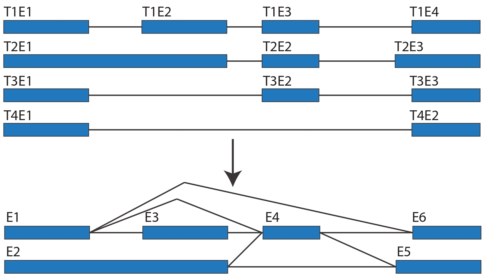

.. Immunopepper documentation master file, created by
   sphinx-quickstart on Thu Jun  1 16:11:33 2023.
   You can adapt this file completely to your liking, but it should at least
   contain the root `toctree` directive.

Immunopepper - Personalized neoantigen discovery
==================================================

**ImmunoPepper** is a software tool for the detection of neoantigens from a splicing graph. It generates the set of all theoretically feasible peptide sequences (or kmers) through
direct translation of all walks along the graph.

The input splice graph is generated using the SplAdder pipeline. SplAdder is a software tool for the detection of alternative splicing events
from RNA-Seq data. Briefly, the splicing graph is generated from one or several **alignment files derived from RNA-Seq data in bam format**,
as well as from a reference annotation file. *Note: The bam file should be accompanied by a bam index file (.bai).*
For more information on how to incorporate this data to generate the input splice graph check out the `build mode of SplAdder <https://spladder.readthedocs.io/en/latest/spladder_modes.html>`_.

    Image showing the construction of a splice graph (bottom) from four transcripts (top). The *Ti* denotes the transcript number and the *Ei* denote exon numbers. **Note: In the lower image the exon numbers do not correspond to the exon numbers in the transcripts i.e. we denote E1 to T1E1, T3E1, T4E1 and E2 to T1E2.*

ImmunoPepper takes all exon-exon junctions present in the splicing graph (From RNA-Seq sample and from the annotation) and translate them into 2 or 3 exons peptides (and kmers).
The peptide set obtained by using this software tool can **optionally be personalized by giving germline and somatic variants as an input.**
The comprehensive peptide set can be subsequently used for further downstream analyses, such as domain annotation or computational immunology.

Check out the :doc:`installation` section for more information on how to install the software tool.

.. note::
    The software tool is currently under development.

.. include:: _key_Contributors.rst

.. toctree::
    installation
    quickstart
    modes
    outputs
    _key_Contributors
    tutorials

Indices and tables
==================

* :ref:`genindex`
* :ref:`modindex`
* :ref:`search`
