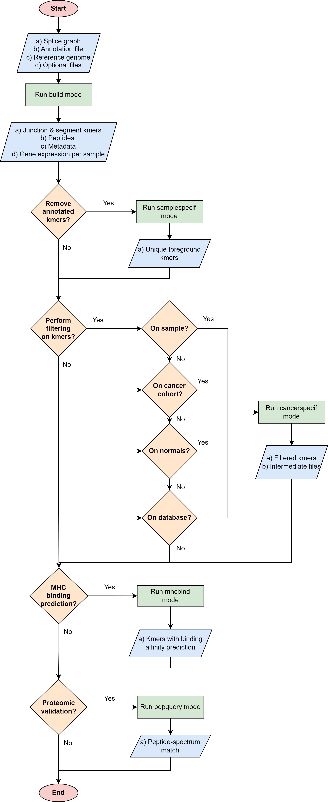

Quick start
============

In this page one will find a quick start guide for the software immunopepper.

Immunopepper is a software tool for the detection of neoantigens from a splicing graph. It generates the set of all theoretically feasible peptide sequences (or kmers) through
direct translation of all walks along the graph.

The general way of using immunopepper varies depending on the aim of the user. The following flowchart be helpful to decide which is the best way to use immunopepper and its different modes, according to the user's needs.

Installation
-------------

For the installation from source, the user needs to clone the git repository of immunopepper. Moreover, there are some prerequisites that need to be installed depending on the mode that is run.

The commands needed to install immunopepper are:

.. code-block::

     git clone https://github.com/ratschlab/immunopepper.git
     conda create -n immunopepper python=3.9
     conda activate immunopepper
     conda install cython
     conda install -c bioconda 'pyvcf3==1.0.3'
     make install

More information on the installation and on the prerequisutes for cancerspecif, mhcbind and pepquery modes can be found in the :ref:`installation` section.

The installation can be tested by running:

.. code-block::

     immunopepper -h

Installation test and usage
-----------------------------

Once you have installed immunopepper, the installation can be tested by running the build mode on an easy dummy example.

More information about the example can be found in the :ref:`tutorials` section.

**Data location:** The data for the example can be found in the github repository under the folder: "immunopepper/tests/data_simulated
/data".

**Command line:** The command line prompt to run the example is:

.. code-block::

    immunopepper  build --output-dir immunopepper_usecase/ --ann-path  immunopepper/tests/data_simulated/data/build_mode/simulated_Ipp.gtf --splice-path  immunopepper/tests/data_simulated/data/build_mode/genes_graph_conf3.merge_graphs.pickle --ref-path  immunopepper/tests/data_simulated/data/build_mode/genome.fa --kmer 9 --count-path immunopepper/tests/data_simulated/data/build_mode/genes_graph_conf3.merge_graphs.count.hdf5 --parallel 1 --batch-size 1  --start-id 0 --process-num 0 --output-fasta --verbose 2

**Terminal output:** The output that you will see in the terminal if the run was successful is:

.. code-block::

    2023-06-22 12:48:54,100 INFO     Command lineNamespace(output_dir='immunopepper_usecase/', ann_path='immunopepper/tests/data_simulated/data/build_mode/simulated_Ipp.gtf', splice_path='immunopepper/tests/data_simulated/data/build_mode/genes_graph_conf3.merge_graphs.pickle', ref_path='immunopepper/tests/data_simulated/data/build_mode/genome.fa', kmer=9, libsize_extract=False, all_read_frames=False, count_path='immunopepper/tests/data_simulated/data/build_mode/genes_graph_conf3.merge_graphs.count.hdf5', output_samples=[], heter_code=0, compressed=True, parallel=1, batch_size=1, pickle_samples=[], process_chr=None, complexity_cap=None, genes_interest=None, start_id=0, process_num=0, skip_annotation=False, libsize_path=None, output_fasta=True, force_ref_peptides=False, filter_redundant=False, kmer_database=None, gtex_junction_path=None, disable_concat=False, disable_process_libsize=False, mutation_sample=None, germline='', somatic='', sample_name_map=None, use_mut_pickle=False, verbose=2)
    2023-06-22 12:48:54,100 INFO     >>>>>>>>> Build: Start Preprocessing
    2023-06-22 12:48:54,100 INFO     Building lookup structure ...
    2023-06-22 12:48:54,101 INFO            Time spent: 0.000 seconds
    2023-06-22 12:48:54,102 INFO            Memory usage: 0.159 GB
    2023-06-22 12:48:54,102 INFO     Loading count data ...
    2023-06-22 12:48:54,104 INFO            Time spent: 0.002 seconds
    2023-06-22 12:48:54,104 INFO            Memory usage: 0.160 GB
    2023-06-22 12:48:54,104 INFO     Loading splice graph ...
    2023-06-22 12:48:54,105 INFO            Time spent: 0.000 seconds
    2023-06-22 12:48:54,105 INFO            Memory usage: 0.161 GB
    2023-06-22 12:48:54,105 INFO     Add reading frame to splicegraph ...
    2023-06-22 12:48:54,107 INFO            Time spent: 0.002 seconds
    2023-06-22 12:48:54,107 INFO            Memory usage: 0.161 GB
    2023-06-22 12:48:54,107 INFO     >>>>>>>>> Finish Preprocessing
    2023-06-22 12:48:54,107 INFO     >>>>>>>>> Start traversing splicegraph
    2023-06-22 12:48:54,107 INFO     >>>> Processing output_sample cohort, there are 9 graphs in total
    2023-06-22 12:48:54,108 INFO     Saving results to immunopepper_usecase/cohort_mutNone
    2023-06-22 12:48:54,108 INFO     Not Parallel
    2023-06-22 12:48:54,108 INFO     >>>>>>>>> Start Background processing
    2023-06-22 12:48:54,111 INFO     Saved ref_annot_peptides.fa.gz with 40 lines in 0.0003s
    2023-06-22 12:48:54,111 INFO     Saved ref_annot_kmer.gz with 294 lines in 0.0002s
    2023-06-22 12:48:54,113 DEBUG    ....cohort: annotation graph from batch all/9 processed, max time cost: 0.0, memory cost: 0.16 GB
    2023-06-22 12:48:54,113 INFO     >>>>>>>>> Start Foreground processing
    2023-06-22 12:48:54,175 INFO     Saved gene_expression_detail.gz with 9 lines in 0.0006s
    2023-06-22 12:48:54,176 INFO     Saved ref_sample_peptides.fa.gz with 88 lines in 0.0004s
    2023-06-22 12:48:54,177 INFO     Saved ref_sample_peptides_meta.gz with 44 lines in 0.0005s
    2023-06-22 12:48:54,177 DEBUG    ....cohort: output_sample graph from batch all/9 processed, max time cost: 0.02, memory cost: 0.16 GB
    2023-06-22 12:48:54,188 INFO     Saved library size results to immunopepper_usecase/expression_counts.libsize.tsv

**Output files:** If the run was successful, you should see the following contents in the output directory:

.. code-block::

    immunopepper_usecase/
    ├── cohort_mutNone
    │ ├── Annot_IS_SUCCESS
    │ ├── gene_expression_detail.gz
    │ ├── output_sample_IS_SUCCESS
    │ ├── ref_annot_kmer.gz
    │ ├── ref_annot_peptides.fa.gz
    │ ├── ref_graph_kmer_JuncExpr
    │ │ ├── part-*.gz
    │ │ ├── part-*.gz
    │ │ └── part-*.gz
    │ ├── ref_graph_kmer_SegmExpr
    │ │ ├── part-*.gz
    │ │ ├── part-*.gz
    │ │ ├── part-*.gz
    │ │ ├── part-*.gz
    │ │ ├── part-*.gz
    │ │ ├── part-*.gz
    │ │ ├── part-*.gz
    │ │ ├── part-*.gz
    │ │ └── part-*.gz
    │ ├── ref_sample_peptides.fa.gz
    │ └── ref_sample_peptides_meta.gz

.. note:: The "*" in some file names refer to a number and letter sequence unique to each run and part.

Other links of interest
-----------------------

- The input parameters and a more detailed description of each mode can be found in :ref:`modes` section.
- A more detailed description of the output files and what they contain can be found in :ref:`outputs` section.
- More tutorials for the different modes are located in the :ref:`tutorials` section.
- The input data for the build tutorial can be found in the folder: **immunopepper/tests/data_simulated/data** The input for the other modes are the outputs of build mode.
- The output data for each of the tutorials can be found under the folder **immunopepper/immunopepper_usecase**:

